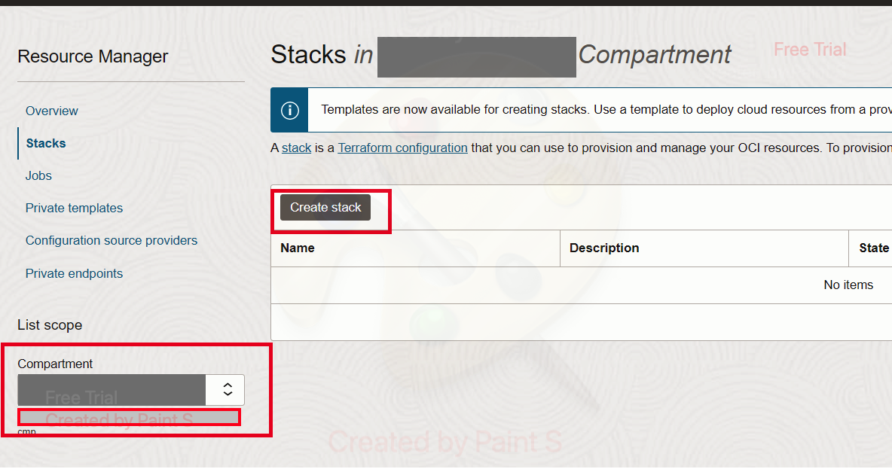
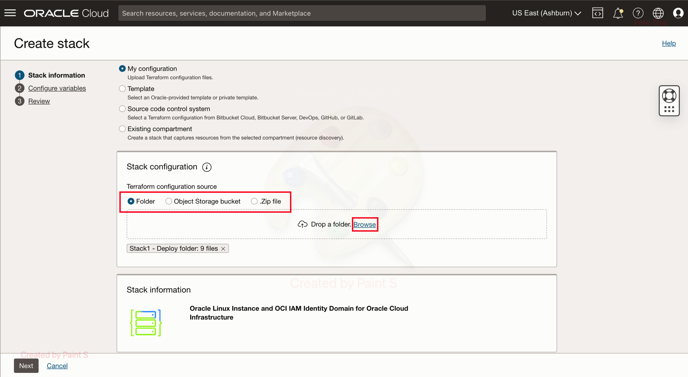
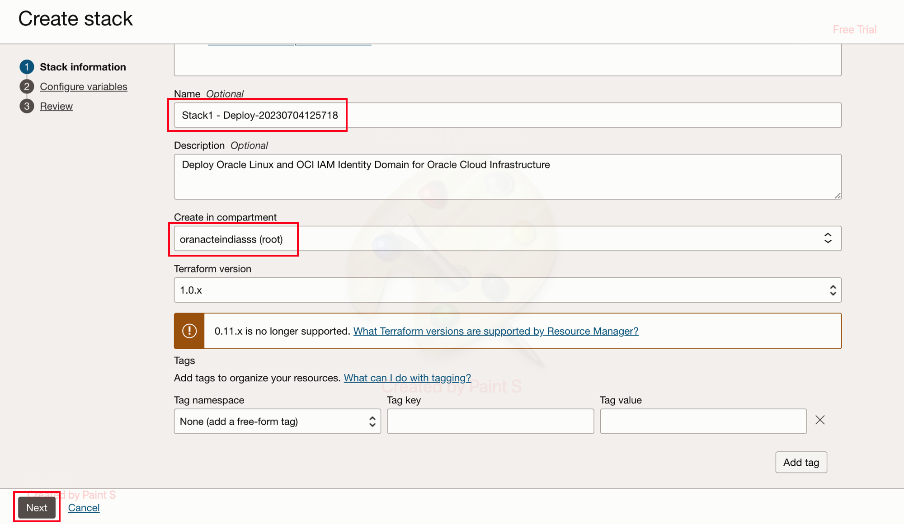
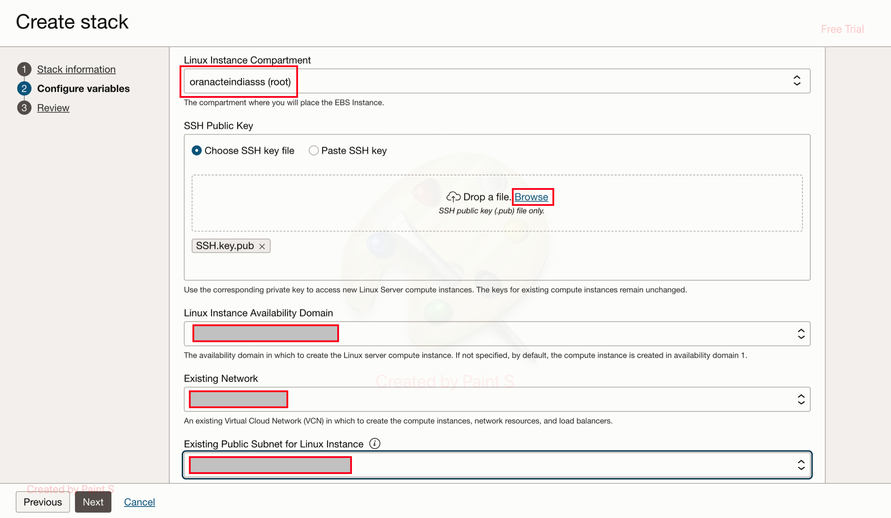
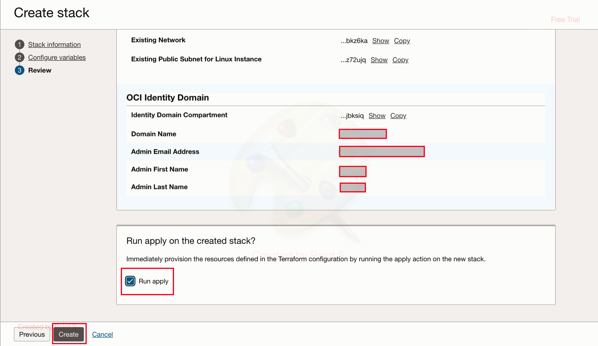

# Deploy ORM stack to create a Linux Server and Identity Domain

## Introduction

Using this stack we will be able to deploy  **Linux Server and Identity Domain** using Terraform. The Identity Domain created will be of the type **Oracle Apps Premium**. On the Linux server we will then configure **Linux Pluggable Authentication Module (PAM) module** using another stack in upcoming lab.

*Estimated Time:* 15 minutes

### Objectives

1.	Deploy a **Linux Server**
2.	Deploy the **Identity Domain** of the type **Oracle Apps Premium**
4.	Validate the created resources via web browser and via SSH access.

### Prerequisites

Once the **Stack1- Deploy.zip** is downloaded, unzip the zip file and replace the the content of the **SSH.key** and **SSH.key.pub** file  with your respective content of the private key and public key.

**Note** Name of the file should not be changed.

## Task 1: Deploy the Stack via Resource Manager

1. Once logged in to the OCI Console, navigate to **Developer Services** then select **Stacks** under **Resource Manager**. Now click on **Create Stack**

	
	
	
 
2. On the Create Stack Wizard, select the **.zip** option and then browse to upload the **Deploy** stack that you downloaded in the previous lab. Now click on **Next**

	
	
	
	
**Note** The Stack Name and Compartment can be changed if required.

3. Now, on the **Configure variables** section, choose the concerned compartment where the VCN resides in **Linux Instance Compartment** section, upload your **SSH Public Key**. Choose the respective **Availability Domain**, **VCN** and **Subnet** where the instance needs to be deployed.

	
	
**Note** SSH Public Key needs to generated as a prerequisites.	
	
4. In the **OCI Identity Domain** section, select the **Identity Domain Compartment** where the domain needs to be created. Then enter the name of the Identity Domain and provide details of the Administrator like **Admin Email Address** , **First Name** and **Last Name**.

	
	
5. Now on the **Review Details** check for the configurations and then click on **Create** . Make sure the **Run Apply** is selected.

	

**Note** The stack might take around 1-2 mins to execute. Please wait until it gets completed successfully. Upon completion, a notification will be sent on the above provided *Admin Email Address* .

## Task 2: Validation of the created resources.

Once the **Stack** is successfully deployed, we will then validate the deployed resources.

	1. Linux Server Instance
	2. Identity Domain 

1. Check the SSH access to your Linux Server using any SSH client. 

*With the Private Key used for the instance, you should be able to SSH into the system*

2. Navigate to **Domains** under **Identity and Security** and the respective Compartment on the OCI console to validate that your Domain of type **Oracle Apps Premium** has been created.

## Conclusion

In this Lab, we were able to successfully deploy and validate a Linux Server and an Identity Domain. 

 You may now **proceed to the next lab.**

## Acknowledgements
* **Author** - Gautam Mishra, Aqib Bhat
* **Contributor** - Deepthi Shetty 
* **Last Updated By/Date** - Gautam Mishra July 2023
